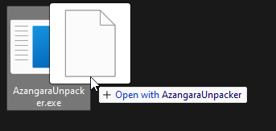

[English version](README_EN.md)

# Azangara (Axysoft) .pak Unpacker

|[**Download / Скачать**](https://github.com/zziger/azangara-unpacker/releases/latest/download/AzangaraUnpacker.exe)|
|-|

## Использование

- Скачать последнюю версию [**тут**](https://github.com/zziger/azangara-unpacker/releases/latest/download/AzangaraUnpacker.exe).
- Для распаковки файла .pak достаточно перенести его на файл AzangaraUnpacker.exe, папка с распакованным содержимым появится рядом с файлом .pak  
- Для упаковки папки достаточно перенести её на файл AzangaraUnpacker.exe, пример выше.
> **Внимание!** При упаковке программа создаст файл .pak рядом с папкой, с таким же названием как у папки. Если такой файл уже есть - программа его перезапишет.

## Лицензия

[MIT](LICENSE)

## Contributions

PR приветствуются. 
Для вопросов - Discord `zziger#8040`